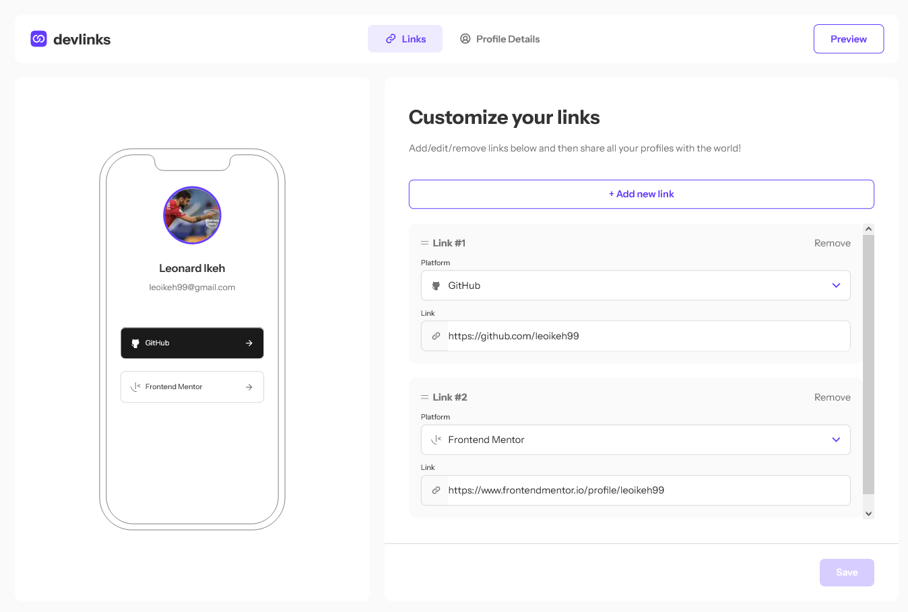
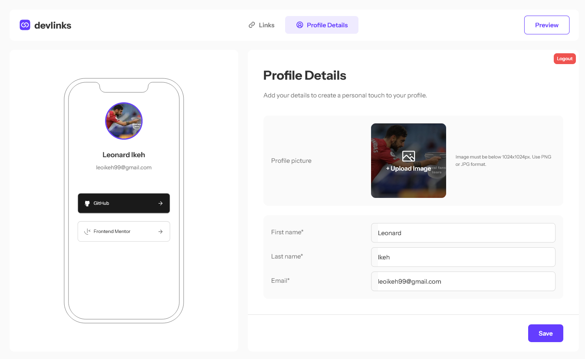
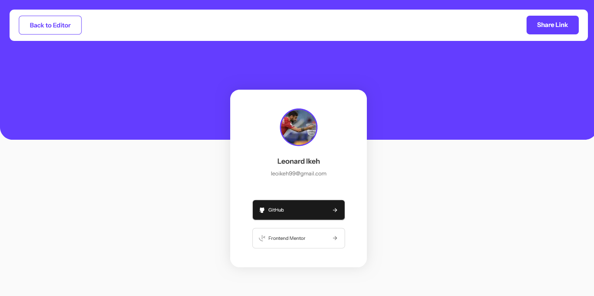

# Link-sharing app

## Table of contents

- [Overview](#overview)
  - [The features](#the-features)
  - [Screenshot](#screenshot)
  - [Links](#links)
- [My process](#my-process)
  - [Built with](#built-with)
  - [Useful resources](#useful-resources)
- [Author](#author)

## Overview

### Features

Users should be able to:

- Create, read, update, delete links and see previews in the mobile mockup
- Receive validations if the links form is submitted without a URL or with the wrong URL pattern for the platform
- Drag and drop links to reorder them
- Add profile details like profile picture, first name, last name, and email
- Receive validations if the profile details form is saved with no first or last name
- Preview their devlinks profile and copy the link to their clipboard
- View the optimal layout for the interface depending on their device's screen size
- See hover and focus states for all interactive elements on the page
- **Bonus**: Save details to a database (build the project as a full-stack app)
- **Bonus**: Create an account and log in (add user authentication to the full-stack app)

### Screenshot

### Links

- Solution URL: [https://github.com/leoikeh99/link-sharing-app](https://github.com/leoikeh99/link-sharing-app)
- Live Site URL: [https://link-sharing-app-three.vercel.app](https://link-sharing-app-three.vercel.app)

## My process

### Built with

- Semantic HTML5 markup
- CSS custom properties
- Flexbox
- CSS Grid
- Mobile-first workflow
- [React](https://reactjs.org/) - JS library
- [Next.js](https://nextjs.org/) - React framework
- [Styled Components](https://styled-components.com/) - For styles
- [MongoDB](https://mongobd.com/) - Database

### Useful resources

- [DnDKit](https://dndkit.com/) - Great Drag n Drop library.

## Author

- Website - [Leonard Ikeh](https://leonardikeh.netlify.app/)
- Frontend Mentor - [@leonard](https://www.frontendmentor.io/profile/leoikeh99)
- Twitter - [@wazza_dev](https://www.twitter.com/wazza_dev)
